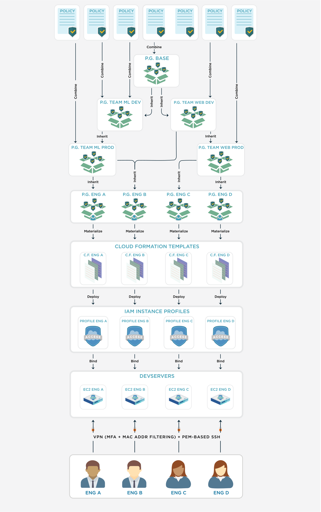

# IAM management as code

Authors: [Peng Su](https://www.linkedin.com/in/peng-su-1a768823/), [Shan Huang](https://www.linkedin.com/in/shanhuangusa/)

<!-- TOC -->

- [Who we are](#who-we-are)
- [Story](#story)
- [Term Definitions](#term-definitions)
- [Background, challenges and solutions](#background-challenges-and-solutions)
    - [Background](#background)
    - [Challenges](#challenges)
    - [Thought process and solutions](#thought-process-and-solutions)
- [Design](#design)
    - [Class of Policy](#class-of-policy)
    - [Class of PolicyGroup](#class-of-policygroup)
- [Generator](#generator)
    - [Template for instance profile](#template-for-instance-profile)
    - [Template for service users](#template-for-service-users)
- [Procedure of changes](#procedure-of-changes)
    - [Example: Add read permission to an S3 bucket (and prefix) to a team](#example-add-read-permission-to-an-s3-bucket-and-prefix-to-a-team)
    - [Example: The tech lead needs a special permission](#example-the-tech-lead-needs-a-special-permission)
- [More discussions](#more-discussions)
- [Summary](#summary)
- [Acknowledgement](#acknowledgement)

<!-- /TOC -->

## Who we are

At Alpha Health we believe every dollar spent on healthcare matters and we are on a mission to remedy the financial complexity which is crippling healthcare in America.

Inspired by the machine learning approaches that made driverless cars possible, Alpha Health is pioneering Unified Automation™ for healthcare revenue cycle management. Unified Automation™ brings together the best of people, data and technology to address financial complexity in our healthcare system.

Alpha Health uses this unique approach and a set of proprietary technologies to provide health systems with a solution to efficiently, accurately, and autonomously navigate the complex state of medical reimbursement in the United States.

## Story

Working along with healthcare providers is no joke, and we have been doing this for a long, long time. We carry the weight and responsibility of many patients and maintaining utmost privacy for them is our job. In Alpha Health we impose strong security requirements on ourselves. For example, all of our client’s data is stored in different databases and they are all encrypted. All activities between ourselves that interact with PHI (Protected Health Information) are logged. And of course, data is stored in the cloud meaning the laptops that our developers use do not have any PHI stored locally and are only used as terminals.

When it comes to security and authentication, each of our engineers has a unique ID that is logged in to the system, so we can track who did what and audit these activities. Here in Alpha Health we adopt the principle of least privilege access, so that you don’t have to worry about privilege escalation in our system. These are policies which we take very seriously in order to mitigate security challenges, but at Alpha Health we believe this alone, is not enough and we strive to go above and beyond in our security practices.

As we strive for cutting edge security methods, we want to implement stronger and sophisticated authorization and authentication tools, and AWS IAM is the one we choose. You might think that just by integrating this tool it will do its magic, but it’s not that simple. We have faced multiple challenges during the implementation and this article will explain these challenges, our thought process, and the solution, with source code provided in [github](https://github.com/alpha-health/aws-iam-management-as-code).

## Term Definitions

- Software Engineers on Infrastructure (or DevOps): a group of engineers at Alpha Health who are in charge of managing the AWS resources, Kubernetes clusters, and authentications/authorizations.

- Developer: the Alpha Health engineers who are not DevOps. They write code to implement the company's business needs and deploy services.

- Permission: a logical group of authorizations to operate certain AWS resources. It can have different granularity, e.g. permission 1 allows reading from an S3 bucket, permission 2 allows reading from a particular prefix of the bucket, then permission 2 is strictly more granular than permission 1. However, it is impossible to define a "most-granular" permission for this S3-read scenario. For example, you can always define an S3 read permission more granular than permission 1 by using a longer prefix. 

- Atomic permission: a logic group of authorizations that always work together, and are not to be divided in the full life-cycle (as far as the Alpha Health developers are concerned).

- IAM policy: an AWS entity, which is a logical group of permissions (not necessarily atomic permissions)

- IAM user: an AWS IAM principal that can be assigned with multiple IAM policies. The IAM user thus owns a union of the permissions from these policies (use [policy evaluation logic](https://docs.aws.amazon.com/IAM/latest/UserGuide/reference_policies_evaluation-logic.html#policy-eval-basics) to handle conflicts). An IAM user can operate AWS resources through two approaches (both can be turned on and off): AWS console (through password and MFA), and AWS CLI (through access_key_id and secret_access_key). One IAM user should be used by a single person (i.e. no password-sharing).

- IAM role: an AWS IAM principal that is similar to IAM user, with the following differences: IAM role is not password-based and can be "assumed" by different IAM principals (such as IAM users); IAM role can access AWS CLI but not AWS console. It is used like a hat that can be worn by different people (or services) as needed. 

- IAM instance profile: an AWS IAM principal that is a "container" for one IAM role. The IAM instance profile can be attached to an EC2 instance and as a result, the contained IAM role can be assumed by the EC2 instance.

- Policy: A self-defined entity in our framework that contains a single atomic permission. 

- PolicyGroup: A self-defined entity in our framework that contains Policies and other PolicyGroups (thus it is a recursive definition).


## Background, challenges and solutions

### Background

At Alpha Health, we have many developers that use our resources in the AWS account, and we need to track each action they take, CloudTrail helps us to do just that by recording all the AWS API calls or in simple words “their actions” with principalId. IAM user and IAM role are both principal types, thus they are logged as principalId in the api calls.

We want our developers to do their magic in the devservers (EC2 instances in the cloud), rather than using their own computers. Laptops are used as terminals to connect into the remote devserver. If we create an IAM user for each engineer, nothing can prevent the engineer from using the access_key_id of the IAM user in the laptops. As discussed above, this is against our security standards. IAM role do not have this problem, as they are not password-based. IAM role can be attached only to EC2 instances, but not laptops. Therefore, we decided to use IAM roles instead of IAM users.

Please note that the assumed IAM role session expires in a configurable amount of time and needs to be refreshed. Auto-refresh feature is already implemented by AWS through instance profile for AWS EC2 instances. We just have to wrap the IAM role into an instance profile and connect it with the EC2 instance, then the instance will auto-refresh the role.

### Challenges

Here comes the worst part, the challenges and inconveniences. AWS's design philosophy is very simple but comes with complications, IAM roles are like hats that can be worn ("assumed") by different AWS principals. But we want to have "personal" roles, meaning each role is only taken by a single engineer (more specifically, the engineer's devserver). Since the engineers need different permissions, managing these IAM roles manually becomes more and more complicated and error-prone. Let's take a look at a scenario.

1) The ML team has five engineers, and they all need a set of permissions. DevOps creates an IAM policy called ML-policy-base with these permissions and assigns the engineers.

2) ML team's tech lead needs some special permissions. Adding these permissions to ML-policy-base is not acceptable, as doing so means granting permission to all members of the ML team, which violates the principle of least privilege. So, the DevOps creates another IAM policy called ML-policy-lead with these special permissions and assigns it to the tech lead.

3) Later on, ML team's tech lead wants to delegate some work to a team member and to do so, the person needs to have a subset of permissions in ML-policy-lead. As you can see, we cannot grant ML-policy-lead to this person since s/he only needs a subset of ML-policy-lead. The only solution is creating another IAM policy named ML-policy-delegate with this subset of permissions and assign to the person. You should be able to see an issue here: ML-policy-delegate and ML-policy-lead have some duplicated permissions.

4) A new team, DS team, needs a subset of permissions in ML-policy-base to perform their work. The same issue arises: we cannot grant ML-policy-base to DS team's members since ML-policy-base contains more than what they need. The DevOps has to create a new IAM policy, named DS-policy-base, to be used by the DS team. You should be able to see the issue again: ML-policy-base and DS-policy-base have duplicated permissions.

### Thought process and solutions

So, the question now is why duplicated permissions in different IAM policies are bad. The answer is simple, it becomes increasingly difficult to maintain. Whenever making a change to a permission, we have to make the same change to all the IAM policies that contain the permission. So, a quick answer is defining a set of atomic permissions and using a tree data structure with multi-level inheritance. Details are shown in the following section.

Another issue that haunts us is lack of version control with AWS IAM. We want to track the history of the permission changes and we want the permission changes to be peer reviewed. So, the solution is using code in a GitHub repo ([link](https://github.com/alpha-health/aws-iam-management-as-code)) to manage these atomic permissions and the tree structure. That's why this article is named "IAM management as code".


## Design



The architecture of IAM as code is shown above. It is a Directed-Acyclic-Graph (DAG). The root of the DAG is a set of Policies, each of which contains an atomic permission. The PolicyGroups inherit from the Policies and other PolicyGroups. For example, Base PolicyGroup contains three Policies that are needed for all the engineers at Alpha Health, such as a permission to access an S3 CDN bucket, and a permission to read a secret in SecretsManager. TeamADev PolicyGroup contains Base PolicyGroup and one additional Policy (which allows deploying to the dev environment). TeamAProd PolicyGroup contains TeamADev PolicyGroup and one more Policy (this one allows deploying to the prod environment). TeamBDev and TeamBProd are similar to team A PolicyGroups. The bottom level PolicyGroups have a one-to-one mapping with individual engineers. As you can see, this design is very flexible: Eng B works cross-functionally and thus has TeamBDev PolicyGroup in addition to TeamAProd PolicyGroup. We use a python script to render CloudFormation manifests from the bottom level PolicyGroups. Each CloudFormation manifest contains a few IAM policies, an IAM role (associated with the IAM policies), and an IAM instance profile. Each manifest will be deployed into AWS as a CloudFormation stack. The IAM instance profile is assigned to an individual developer's devserver. No developer can use other people's IAM instance profile.


### Class of Policy

Each instance of Policy contains an atomic permission. Note that atomic permission is defined based on Alpha Health engineering needs. The AWS resources' naming needed to be designed appropriately to accommodate this need. For example, we separate clients' data using S3 prefixes, like `s3://ops-data/{client}`. Then the authorizations needed to read from `s3://ops-data/tcm/*` is an atomic permission and should be used by an IAM user for client tcm. The authorizations needed to read from `s3://ops-data/*` is also an atomic permission, for the usage of developers. (Alpha Health developers work across all clients, instead of being assigned to specific clients.)

```
from typing import List
INDENT = '  '
DEFAULT_INDENT = 5
class Condition():
    def __init__(
        self,
        name,
        operator: str,
        condition_key: str,
        values: List[str],
    ):
        self.name = name
        self.operator = operator
        self.condition_key = condition_key
        self.values = values

    def to_yaml(self, **kargs) -> str:
        """Convert the condition to a yaml string"""
        base_indent = (DEFAULT_INDENT + 2) * INDENT
        name_str = f"\n{base_indent}# {self.name}"
        operator_str = f"\n{base_indent}{self.operator}:"
        condition_str = f"\n{base_indent}{INDENT}{self.condition_key}:"
        values_str = ''
        for value in self.values:
            values_str += f"\n{base_indent}{2*INDENT}- \"{value}\""
        yaml = name_str + operator_str + condition_str + values_str
        for k, v in kargs.items():
            self._template_replace(yaml, k, v)
        return yaml

    def __lt__(self, other):
        return self.name < other.name

    def _template_replace(self, template, key, value):
        return template.replace("{{{}}}".format(str(key)), value)


class Policy():
    def __init__(
        self,
        name: str,
        effect: str,
        actions: List[str],
        resources: List[str],
        conditions: List[Condition] = None,
    ):
        """Initialize the Policy object"""
        self.name = name
        self.effect = effect
        self.actions = actions
        if isinstance(actions, str):
            raise ValueError("Actions must be a list, got %r." % actions)
        self.resources = resources
        self.conditions = conditions

    def to_yaml(self, **kargs) -> str:
        """Convert the policy to a yaml string"""
        base_indent = DEFAULT_INDENT * INDENT
        name_str = f"\n{base_indent}# {self.name}"
        effect_str = f"\n{base_indent}- Effect: \"{self.effect}\""
        action_str = ''
        for action in self.actions:
            action_str += f"\n{base_indent}{2*INDENT}- \"{action}\""
        action_str = f"\n{base_indent}{INDENT}Action:{action_str}"
        resource_str = ''
        for resource in self.resources:
            resource_str += f"\n{base_indent}{2*INDENT}- \"{resource}\""
        resource_str = f"\n{base_indent}{INDENT}Resource:{resource_str}"
        condition_str = ''
        if self.conditions is not None:
            condition_str += f"\n{base_indent}{INDENT}Condition:"
            for condition in self.conditions:
                condition_str += condition.to_yaml()
        yaml = name_str + effect_str + action_str + resource_str + condition_str
        for k, v in kargs.items():
            yaml = self._template_replace(yaml, k, v)
        return yaml

    def __lt__(self, other):
        return self.name < other.name

    def _template_replace(self, template, key, value):
        return template.replace("{{{}}}".format(str(key)), value)
```

An atomic permission needs a name, effect, a list of actions, a list of resources, and an optional list of conditions. See below for an example Policy named `S3AllowListOnBucketMldata` that allows `s3:ListBucket` on the bucket `ops-data`. Note that `s3:ListBucket` grants permission to list some or all objects in this bucket, and the resource for it must be buckets. If one wants to allow listing only a subset of objects, s/he can do it by using setting up a condition, see example of `S3AllowListOnBucketMldataPrefixDevserver`, which allows `s3:ListBucket` only on prefixes that looks like `devserver/*` (regex-wise). 

```
POLICY_S3_LIST_MLDATA_BUCKET = Policy(
    'S3AllowListOnBucketMldata',
    'Allow',
    ['s3:ListBucket'],
    [
        'arn:aws:s3:::ops-data',
    ],
)
```

```
POLICY_S3_LIST_MLDATA_BUCKET_PREFIX_DEVSERVER = Policy(
    'S3AllowListOnBucketMldataPrefixDevserver',
    'Allow',
    ['s3:ListBucket'],
    [
        'arn:aws:s3:::ops-data',
    ],
    conditions = [ Condition(
        name=f"RestrictListBucketToPrefix",
        operator="StringLike",
        condition_key="s3:prefix",
        values=["devserver/*"])
    ]
)
```

### Class of PolicyGroup

As shown in the architecture, the middle and leaf nodes are PolicyGroups. Each leaf node is mapped to an engineer. Code of such mapping is in the Generator. 

As shown in the code below, PolicyGroup contains a list of Policies and a list of PolicyGroups. The `flatten()` function will fetch all the Policies recursively through a depth-first search. The `to_yaml()` function will sort these flattened Policies by name and render them to a YAML format. The generated yaml files will be managed by git. Sorting is mainly for ease of showing file differences in GitHub pull-requests. 

```
class PolicyGroup():
    def __init__(self, policies=None, policy_groups=None):
        """Initialize the object with policies and policy_groups. Note that PolicyGroup has a nested 
        definition, i.e. a policyGroup can contain other policyGroups. But there is no need to do 
        cycle detections, since the policyGroups are immutable, thus a parent can never refer to its
        child (the child does not exist yet when the parent is initialized), thus cycle does exist."""
        
        self.policies = policies
        self.policy_groups = policy_groups
        self.policies_dedupped = None

    def flatten(self):
        if self.policies_dedupped is not None:
            return self.policies_dedupped
        self.policies_dedupped = set()
        if self.policies is not None:
            for policy in self.policies:
                self.policies_dedupped.add(policy)
        if self.policy_groups is not None:
            for policy_group in self.policy_groups:
                self.policies_dedupped.update(policy_group.flatten())
        return self.policies_dedupped

    def to_yaml(self, **kargs) -> str:
        """ Convert the policyGroup to a yaml string"""
        flattened = self.flatten()
        yaml_str = ''
        for policy in sorted(list(flattened)):
            yaml_str += policy.to_yaml(**kargs)
        return yaml_str
```

## Generator

For each engineer, we use CloudFormation to generate an IAM instance profile, which is attached to the engineer's EC2 devserver. The CloudFormation manifest is generated by filling a template. The template includes a few things: a few IAM policies, an IAM role that is associated with these IAM policies, and an IAM instance profile that "contains" the IAM role. Theoretically, each PolicyGroup produces a single IAM Policy. Why do we have a few IAM policies in a CloudFormation stack? The reason is AWS IAM has a hard limit of 6,144 characters for each IAM policy (see [Ref](https://docs.aws.amazon.com/IAM/latest/UserGuide/reference_iam-quotas.html#reference_iam-limits-entity-length)). The generated IAM policy for a PolicyGroup easily exceeds 6,144 characters. That's why we need to split it. As of now, we use the heuristic rule, i.e. all S3-related permissions go to the 1st IAM policy, all SecretsManager-related permissions go to the 2nd IAM policy, and the remaining goes to the 3rd IAM policy. We can always do more splitting if needed.


### Template for instance profile

The CloudFormation template for IAM instance profile is shown below. `{Policies}` is a combination of multiple IAM policies, which are generated by the IAM policy template below. Using engineer Jane Doe as an example, `RoleName` will be `PersonalRoleJaneDoe`, `InstanceProfileName` will be `PersonalInstanceProfileJaneDoe`, and the three `PolicyNames` will be `PersonalPolicyS3JaneDoe`, `PersonalPolicySecretManagerJaneDoe` and `PersonalPolicyMiscJaneDoe`. The code used to render the CloudFormation manifest from the template is in [github](https://github.com/alpha-health/aws-iam-management-as-code).


Devserver profile CloudFormation template:
```
AWSTemplateFormatVersion: {TemplateFormatVersion}
Description: {ProfileDescription}

Resources:
{Policies}
  {RoleName}:
    Type: AWS::IAM::Role
    Properties:
      AssumeRolePolicyDocument:
        Version: {AssumeRolePolicyDocumentVersion}
        Statement:
        - Effect: Allow
          Principal:
            Service:
            - ec2.amazonaws.com
          Action:
          - sts:AssumeRole
        - Effect: Allow
          Principal:
            AWS:
            - arn:aws:iam::025412125743:user/ServiceUserProdKrun
          Action:
          - sts:AssumeRole
      Path: "/"
      ManagedPolicyArns:
        - arn:aws:iam::aws:policy/CloudWatchAgentServerPolicy
{PolicyReferences}
      RoleName: {RoleName}

  {InstanceProfileName}:
    Type: AWS::IAM::InstanceProfile
    Properties:
      InstanceProfileName: {InstanceProfileName}
      Path: "/"
      Roles:
      - !Ref {RoleName}
```

IAM policy template:
```
  {PolicyName}:
    Type: AWS::IAM::ManagedPolicy
    Properties:
      Description: {PolicyDescription}
      ManagedPolicyName: {PolicyName}
      Path: /
      PolicyDocument:
        Version: {PolicyDocumentVersion}
        Statement: {Effects}
```


### Template for service users

Note that in addition to personal roles, the framework discussed above can be applied to other kinds of IAM needs, as long as appropriate templates are defined. For example, to use the framework to managed an IAM user, the template is defined like below. We won't go into details for this template in this article.

```
AWSTemplateFormatVersion: {TemplateFormatVersion}
Description: {StackDescription}

Resources:
  {PolicyName}:
    Type: AWS::IAM::ManagedPolicy
    Properties:
      Description: {PolicyDescription}
      ManagedPolicyName: {PolicyName}
      Path: "/"
      PolicyDocument:
          Version: {PolicyDocumentVersion}
          Statement: {Effects}

  {GroupName}:
    Type: AWS::IAM::Group
    Properties:
      GroupName: {GroupName}
      ManagedPolicyArns:
        - !Ref {PolicyName}

  {UserName}:
    Type: AWS::IAM::User
    Properties: 
      Groups: 
        - !Ref {GroupName}
      UserName: {UserName}
```


## Procedure of changes

Using the IAM-as-code discussed above, the procedure to make IAM changes is as below.

1. An engineer makes code changes in the python scripts
2. The engineer runs CloudFormation generator which modifies/adds files to the repo
3. The engineer submits a Github PR with the file changes
4. The DevOps team reviews the PR, comments and fixes
5. The engineer (or DevOps) merges the PR
6. The DevOps team deploys the IAM changes (only DevOps team has permissions to do so)


### Example: Add read permission to an S3 bucket (and prefix) to a team

The tech lead of the team needs to create an S3-read Policy, see below. It allows listing all objects in the bucket and reading the objects in prefix `streaming/*`.

And then the tech lead adds the Policy to the PolicyGroup of the team.

Since each ML team member's PolicyGroup either contains the `POLICY_GROUP_TEAM_ML` or is `POLICY_GROUP_TEAM_ML` itself, this change will be reflected in all ML team members. 

```
POLICY_S3_READ_MLDATA_BUCKET_PREFIX_STREAMING = Policy(
    'S3AllowReadOnBucketMldataPrefixStreaming',
    'Allow',
    [
        's3:GetObject',
        's3:GetObjectAcl',
        's3:GetObjectVersion',
        's3:ListBucket',
        's3:ListObjectVersions',
        's3:GetBucketLocation',
    ],
    [
        'arn:aws:s3:::ml-data',
        'arn:aws:s3:::ml-data/streaming/*',
    ],
)

POLICY_GROUP_TEAM_ML = PolicyGroup(policies=[
    ## Existing policies ...
    POLICY_S3_READ_MLDATA_BUCKET_PREFIX_STREAMING,
])
```

### Example: The tech lead needs a special permission

Same as above, the tech lead (name is John Doe) creates a Policy for the special permission. And then s/he adds the new Policy to the personal PolicyGroup, see below. If the tech lead used to use `JohnDoe: POLICY_GROUP_TEAM_ML` mapping in the generator, now he can change it to `JohnDoe: POLICY_GROUP_JOHN_DOE`. You can tell how flexible the system is.

```
POLICY_ML_SPECIAL = ...

POLICY_GROUP_JOHN_DOE = PolicyGroup(
    policies=[
        POLICY_ML_SPECIAL,
    ],
    policiGroups=[
        POLICY_GROUP_TEAM_ML,
    ],
)
```

## More discussions

Since we use Kubernetes (AWS managed EKS), the developers need to be authenticated when operating the Kubernetes cluster. We use a [ConfigMap](https://kubernetes.io/docs/concepts/configuration/configmap/) to map the developers' IAM roles to a ClusterRole (called eng-clusterrole), which has the proper authorizations to operate the Kubernetes cluster. If you do not know ClusterRole in Kubernetes, refer to [this link](https://kubernetes.io/docs/reference/access-authn-authz/rbac/).

Since we restrict the developers' access to the AWS console, a problem arises: how can the developers get the CodeBuild artifact and logs? (Context: at Alpha Health we use AWS CodeBuild to build the docker images or artifacts.) So our solution is to build a tool called `cbgm`, which is a script containing AWS CLI commands, to assist the developers in fetching CodeBuild logs and artifacts.


## Summary

- Each engineer has his/her own IAM role, thus all logged activities have a unique owner and can be easily tracked.
- Due to the multi-inheritance structure, we eliminate duplicates.
- Principle of least privilege. The DevOps team has a centralized control that adheres to this principle.
- Changing permission is a systematic, fast and secure process.

## Acknowledgement

The authors thank Varun Ganapathi, Andy Atwal, Jesse Swidler, Michael Davis, and Dave Lawson for their reviews and suggestions. 

[1]:<https://medium.com/better-programming/breaking-down-awss-identity-access-management-iam-cb51c9195e4f>